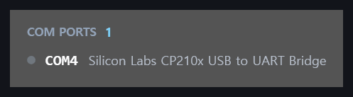
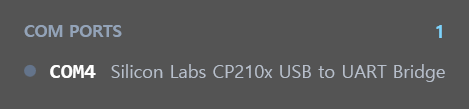
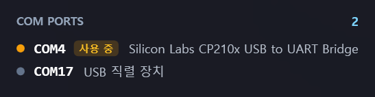
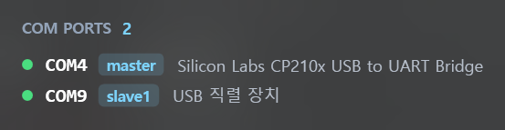
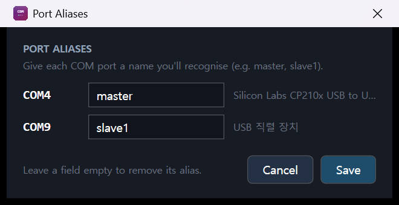

# ComportMonitor

[한국어](README.md) · **English**

A translucent **COM port monitor widget** that floats on your Windows desktop. See at a glance which serial ports are connected and which ones another program is using — without ever opening Device Manager. Built for the plug-and-unplug workflow of embedded development (ESP32, Arduino, and the like).



> When another program opens a port, its dot turns green, and returns to grey when the port is released.

| Default (acrylic blur) | Max tint (near-opaque) |
|---|---|
|  |  |

## Features

- **Live list** — updates the instant a USB device is plugged or unplugged (`WM_DEVICECHANGE` events, no polling)
- **Connect/disconnect highlight** — new ports flash 🟠 amber, removed ports show a 🔴 red strikethrough for 4 seconds
- **In-use detection** — ports held by another program (terminal, flasher, etc.) show a 🟢 green dot (with an `In use` tooltip on hover; checked every 3 s, toggleable from the right-click menu)
- **Port aliases** — label each port with a name like `master` or `slave1` (see below)
- **Change COM number** — click a port to jump straight to its Windows device dialog (no admin rights needed)
- **Device names** — the same friendly name as Device Manager (e.g. `Silicon Labs CP210x USB to UART Bridge`), with VID/PID in the tooltip
- **Opacity control** — one axis from solid panel ↔ acrylic blur ↔ ghost mode (text fades too)
- **Edge magnet snap** — snaps to monitor edges while dragging
- **Auto-hide** — hides after 5 minutes with no port activity, reappears on the next change (optional). While hidden it also returns its memory to the OS
- **Tray icon** — left-click to show/hide, right-click menu to exit
- **Widget UX** — always on top, hidden from taskbar/Alt-Tab, drag to move, position & settings saved automatically

## Per-port settings — just click the port

**Click a port** in the list to open a menu for that port:

```
COM4  (master)          ← which port this is
─────────────────
Set alias...            ← name this port
Remove alias            ← (only when it has one)
Change COM number...    ← renumber this port
```

Rows highlight on hover so you can tell they're clickable, and dragging a row still **moves the widget** as before.

### Aliases

When COM numbers alone don't tell you which board is which, give each port a name.





- Aliases are keyed by **COM number**, so they survive unplugging the board or rebooting the PC
- Ports that aren't currently connected (`(not connected)`) can still be labelled ahead of time or cleared
- Clear a field and save to remove that alias
- Right-click → **Set aliases...** edits them all at once; **Show aliases** toggles the display

### Changing a COM number

**Change COM number...** opens that device's Windows properties dialog directly, where you can set it under `Port Settings → Advanced → COM Port Number` — no digging through Device Manager.

- Windows does the actual change, so **no administrator rights are required**
- If you renumber a port, its **alias follows to the new number automatically**

## Controls

| Action | How |
|---|---|
| Per-port settings (alias · COM number) | **Click a port** in the list |
| Move | Drag the widget (snaps near monitor edges) |
| Opacity | **Ctrl + mouse wheel** over the widget (up = more solid, down = more transparent) |
| Edit all aliases / toggle display | **Right-click** → `Set aliases...` / `Show aliases` |
| Refresh / options / exit | **Right-click** context menu |

Settings are stored in `%APPDATA%\ComportMonitor\settings.json`.

## Download

From [Releases](https://github.com/firepooh/ComportMonitor/releases):

| File | Size | Requirement |
|---|---|---|
| `ComportMonitor-standalone.exe` | ~60 MB | None — runs on any PC |
| `ComportMonitor.exe` | ~1 MB | Needs the [.NET 8 Desktop Runtime](https://dotnet.microsoft.com/download/dotnet/8.0) (you'll get an install prompt if it's missing) |

## Requirements

- Windows 11 (the acrylic background and rounded corners use DWM features; on Windows 10 the appearance may differ)

## Build

```
dotnet build -c Release
```

Or just open `ComportMonitor.csproj` in Visual Studio 2022.
Output: `bin\Release\net8.0-windows\ComportMonitor.exe`

## How it works

- **Port enumeration**: filters WMI `Win32_PnPEntity` by the Ports class GUID (`{4d36e978-e325-11ce-bfc1-08002be10318}`). `Win32_SerialPort` is avoided because it misses USB CDC devices (e.g. the ESP32-S3 USB-JTAG).
- **In-use detection**: a `CreateFile` probe with zero access rights. Serial drivers allow only a single open, so zero-access is enough to tell whether a port is taken — and because it never initialises the port, the risk of a DTR/RTS glitch (board reset) is minimised.
- **Translucent window**: WPF `AllowsTransparency` is avoided because it clips the window to 96-DPI dimensions when the monitor DPI differs from the system DPI. Instead the app uses the DWM acrylic backdrop (`DWMWA_SYSTEMBACKDROP_TYPE`), and ghost mode is done with manual `WS_EX_LAYERED` + `SetLayeredWindowAttributes` — WPF strips that style, so a `SetWindowSubclass` hook restores the bit right after WPF processes it.

## License

[MIT](LICENSE)
