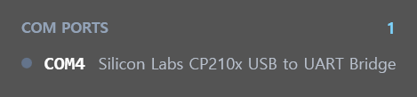

# ComportMonitor

Windows 바탕화면에 항상 떠 있는 **COM 포트 모니터 위젯**입니다. 장치 관리자를 열지 않고도 어떤 시리얼 포트가 연결되어 있는지, 어떤 포트를 다른 프로그램이 쓰고 있는지 실시간으로 보여줍니다. ESP32 등 임베디드 보드를 자주 꽂았다 뽑는 개발 환경을 위해 만들었습니다.

| 기본 (아크릴 블러) | 틴트 최대 (거의 불투명) |
|---|---|
|  |  |

## 기능

- **실시간 목록 갱신** — USB 장치를 꽂고 뽑는 순간 즉시 반영 (`WM_DEVICECHANGE` 이벤트 방식, 폴링 없음)
- **연결/해제 하이라이트** — 새 포트는 🟢 초록, 사라진 포트는 🔴 빨간 취소선으로 4초간 표시
- **포트 점유 표시** — 다른 프로그램(터미널, 플래셔 등)이 사용 중인 포트에 🟠 주황 점 + `사용 중` 배지 (3초 주기, 우클릭 메뉴에서 끄기 가능)
- **장치 이름 표시** — 장치 관리자와 동일한 친화명 (예: `Silicon Labs CP210x USB to UART Bridge`), 툴팁으로 VID/PID 확인
- **투명도 조절** — 진한 패널 ↔ 아크릴 블러 ↔ 유령 모드(글자까지 페이드)를 한 축으로 조절
- **위젯 UX** — 항상 위, 작업표시줄/Alt+Tab 숨김, 드래그 이동, 위치·설정 자동 저장

## 조작법

| 동작 | 방법 |
|---|---|
| 이동 | 위젯을 마우스로 드래그 |
| 투명도 조절 | 위젯 위에서 **Ctrl + 마우스 휠** (위 = 진하게, 아래 = 투명하게) |
| 새로 고침 / 옵션 / 종료 | **우클릭** 컨텍스트 메뉴 |

설정은 `%APPDATA%\ComportMonitor\settings.json`에 저장됩니다.

## 다운로드

[ComportMonitor-releases](https://github.com/firepooh/ComportMonitor-releases/releases) (배포 전용 공개 저장소)에서 받을 수 있습니다:

| 파일 | 크기 | 조건 |
|---|---|---|
| `ComportMonitor-standalone.exe` | ~60MB | 없음 — 아무 PC에서나 바로 실행 |
| `ComportMonitor.exe` | ~1MB | [.NET 8 Desktop Runtime](https://dotnet.microsoft.com/download/dotnet/8.0) 필요 (없으면 실행 시 설치 안내가 뜸) |

## 요구 사항

- Windows 11 (아크릴 배경·둥근 모서리는 DWM 기능 사용. Windows 10에서는 외형만 다르게 표시될 수 있음)

## 빌드

```
dotnet build -c Release
```

Visual Studio 2022에서 `ComportMonitor.csproj`를 바로 열어도 됩니다.
실행 파일: `bin\Release\net8.0-windows\ComportMonitor.exe`

## 동작 원리

- **포트 열거**: WMI `Win32_PnPEntity`에서 Ports 클래스 GUID(`{4d36e978-e325-11ce-bfc1-08002be10318}`)로 필터링합니다. `Win32_SerialPort`는 USB CDC 장치(ESP32-S3 USB-JTAG 등)를 누락하므로 쓰지 않습니다.
- **점유 감지**: 액세스 권한 0의 `CreateFile` 프로브. 시리얼 드라이버는 단일 오픈만 허용하므로 권한 0으로도 점유가 정확히 판별되고, 포트를 초기화하지 않아 DTR/RTS 글리치(보드 리셋) 위험이 최소화됩니다.
- **반투명 창**: WPF `AllowsTransparency`는 모니터 DPI ≠ 시스템 DPI 환경에서 창 크기가 96DPI 기준으로 잘리는 버그가 있어 사용하지 않습니다. 대신 DWM 아크릴 백드롭(`DWMWA_SYSTEMBACKDROP_TYPE`)을 쓰고, 유령 모드는 수동 `WS_EX_LAYERED` + `SetLayeredWindowAttributes`로 구현했습니다 — WPF가 이 스타일을 강제로 벗겨내므로 `SetWindowSubclass`로 WPF 처리 직후 비트를 되살리는 우회가 들어 있습니다.

## 라이선스

[MIT](LICENSE)
